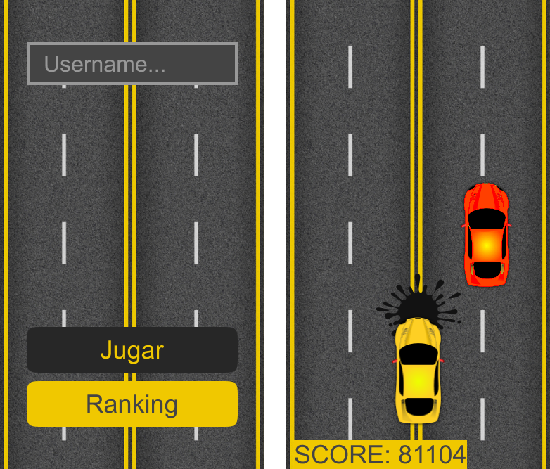

# Turbo Tracks 🚗

Turbo tracks es un juego de autos 2D hecho con **pygame**, en el cual el jugador debe esquivar los obstáculos que se le presentan en el camino, mientras intenta llegar lo más lejos posible. 🚩🚩

Puedes encontrar el codigo principal del juego aqui 👉 [app.py](code/app.py)

## 📖 Descripción

El juego cuenta con un **menú principal**, en el cual se puede elegir entre jugar o ver el ranking de puntuaciones, donde podra ver un listado con el nombre de los jugadores ordenados por su puntuacion.

Desde el ranking se puede volver al menú principal, y desde el menú principal se puede volver a jugar. 

El juego se controla con las flechas del teclado o las teclas A y D, para moverse de izquierda a derecha. El juego termina cuando el jugador choca con otro auto. 🚧 ‼

## 📊 Base de datos 

Para el almacenamiento de los datos se utilizó una base de datos **SQLite**, la cual se encuentra en el archivo `database.db`. Y guarda el nombre de usuario ingresado junto a su puntuacion. Ademas, de estar ordenadas de la mayor a la menor puntuacion.
